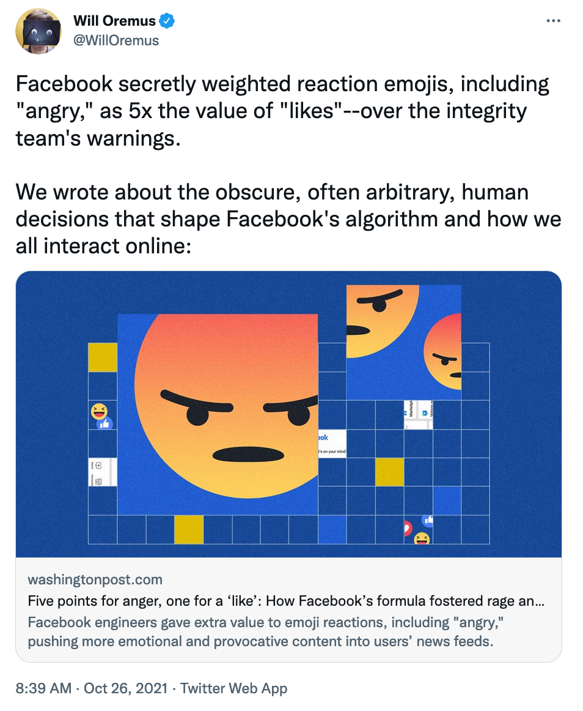
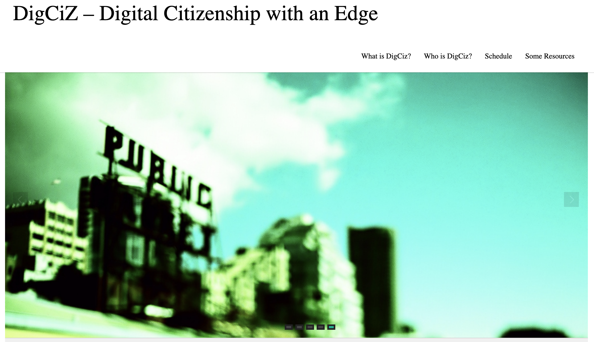
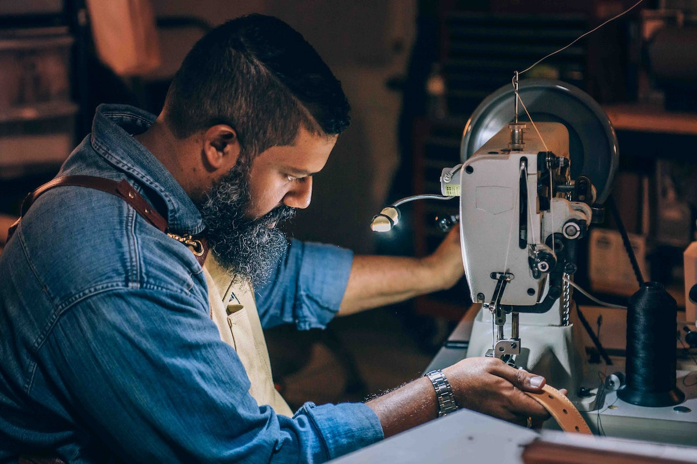

```{r setup, include=FALSE}
usethis::use_git_ignore(c("*.csv", "*.rds"))
options(htmltools.dir.version = FALSE)

library(knitr)
library(tidyverse)
library(xaringan)
library(fontawesome)
```

class: inverse, center, middle

# `r fa("far fa-images", fill = "#fff")`

**View the slides:** 

[bretsw.github.io/eme6356-module7](https://bretsw.github.io/eme6356-module7)

---

class: inverse, center, middle

# `r fa("fas fa-user-astronaut", fill = "#fff")` <br> Special Guest: <br> Autumm Caines

---

# Autumm Caines

```{r, out.width = "600px", echo = FALSE, fig.align = "center"}
include_graphics("img/7-Autumm-Caines.jpg")
```

<div class="caption">
<a href="http://autummcaines.com/">Autumm Caine's website</a>
</div>

---

# Data Stories

```{r, out.width = "360px", echo = FALSE, fig.align = "center"}

```

"We wrote about the obscure, often arbitrary, human decisions that shape Facebook's algorithm and how we all interact online:" (Tweet from [@WillOremus](https://twitter.com/WillOremus/status/1452978182882275335))

---

class: inverse, center, middle

# `r fa("fas fa-calculator", fill = "#fff")` <br> Technoethics

---

# Is This Technology Ethical?

```{r, out.width = "100%", echo = FALSE, fig.align = "center"}
include_graphics("img/7-technology-ethical.png")
```

<div class="caption">
<a href="https://technoethics.digciz.org/index.php/is-technology-ethical-analysis-helper/">Is This Technology Ethical? Analysis Helper for Educators</a>
</div>

---

# Black Mirror MadLibs

```{r, out.width = "100%", echo = FALSE, fig.align = "center"}
include_graphics("img/7-madlibs.png")
```

<div class="caption">
<a href="https://bretsw.shinyapps.io/data-dystopia/">Dystopian Storytelling</a>
</div>

---

# CompelU

```{r, out.width = "100%", echo = FALSE, fig.align = "center"}
include_graphics("img/7-compelu.png")
```

<div class="caption">
<a href="https://compelu.com/">CompelU: We Watch We Care</a>
</div>

---

# DigCiz

```{r, out.width = "100%", echo = FALSE, fig.align = "center"}

```

<div class="caption">
<a href="https://digciz.org/">Technoethics DigCiz: Thinking about the ethics of technology as digital citizenship</a>
</div>

---

class: inverse, center, middle

# `r fa("far fa-comments", fill = "#fff")` <br> Module 6 Discussion

---

# Sharing Kudos

```{r, out.width = "560px", echo = FALSE, fig.align = "center"}

```

--

Kudos for sharing color-coded Microsoft Excel reports:

- `r fa("thumbs-up", fill = "#782F40")` Jackie
- `r fa("thumbs-up", fill = "#782F40")` Carla

---

class: inverse, center, middle

#  `r fa("far fa-lightbulb", fill = "#fff")` <br> Big Idea \#1: <br> **Sequencing**

---

# Sequencing

```{r, out.width = "480px", echo = FALSE, fig.align = "center"}
include_graphics("img/step.jpg")
```

### Why

---

# Sequencing

```{r, out.width = "480px", echo = FALSE, fig.align = "center"}
include_graphics("img/step.jpg")
```

### Why `r fa("fas fa-arrow-right", fill = "#782F40")` What

---

# Sequencing

```{r, out.width = "480px", echo = FALSE, fig.align = "center"}
include_graphics("img/step.jpg")
```

### Why `r fa("fas fa-arrow-right", fill = "#782F40")` What `r fa("fas fa-arrow-right", fill = "#782F40")` How

---

# Sequencing: The Why

```{r, out.width = "600px", echo = FALSE, fig.align = "center"}
include_graphics("img/puzzle-gap.jpg")
```

--

- Start with the design, not the process (`r fa("thumbs-up", fill = "#782F40")` Shané)

--

- Name the problem, research questions, significance

--

- Answer, "So what?"

---

# Sequencing: The What

```{r, out.width = "420px", echo = FALSE, fig.align = "center"}

```

--

- Data enables, not drives, inquiry (`r fa("thumbs-up", fill = "#782F40")` Tiffany)

--

- Looking at **learning**: 

--

  - Data as a proxy for effort, engagement, skill (`r fa("thumbs-up", fill = "#782F40")` Aisha)

--

  - Imagine the figures that would show these proxies (`r fa("thumbs-up", fill = "#782F40")` Mark)

---

# Sequencing: The How

```{r, out.width = "480px", echo = FALSE, fig.align = "center"}

```

--

- Take stock of the tools you do have (`r fa("thumbs-up", fill = "#782F40")` Sean, Colleen)

--

  - [Data Viz Tools padlet](https://fsu.padlet.org/bretsw/xxl6opndte57rmc5)

--

- Pursue microcredentials (`r fa("thumbs-up", fill = "#782F40")` Kent, Rocco)

--

  - [Linkedin Learning through FSU](https://its.fsu.edu/linkedinlearning)
  
--

- Connect to other disciplines like usability, info science (`r fa("thumbs-up", fill = "#782F40")` Mark)


---

class: inverse, center, middle

#  `r fa("far fa-lightbulb", fill = "#fff")` <br> Big Idea \#2: <br> **Usefulness**

---

# Not Useful

```{r, out.width = "540px", echo = FALSE, fig.align = "center"}

```

--

- Lots of data, bad visualization (`r fa("thumbs-up", fill = "#782F40")` Lori, `r fa("thumbs-up", fill = "#782F40")` Jackie)

--

- Data driving the why (`r fa("thumbs-up", fill = "#782F40")` Kahiya)

--

- Users don't understand the data or analysis (`r fa("thumbs-up", fill = "#782F40")` Dré)

---

# Useful

```{r, out.width = "600px", echo = FALSE, fig.align = "center"}
include_graphics("img/tools.jpg")
```

--

- Immediate feedback: Putting data into action (`r fa("thumbs-up", fill = "#782F40")` Kahiya)

--

- Alignment: Connecting a dashboard to strategic plan (`r fa("thumbs-up", fill = "#782F40")` Tiffany) 

--

- Spotting disengagement: Principles from usability (`r fa("thumbs-up", fill = "#782F40")` Mark)

---

class: inverse, center, middle

#  `r fa("far fa-lightbulb", fill = "#fff")` <br> Big Idea \#3: <br> **Trustworthiness**

---

# Trustworthiness

```{r, out.width = "480px", echo = FALSE, fig.align = "center"}
include_graphics("img/help.jpg")
```

--

`r fa("fas fa-book-open", fill = "#782F40")` [*Determining Validity in Qualitative Inquiry*](https://fsu-flvc.primo.exlibrisgroup.com/permalink/01FALSC_FSU/1pc67ru/cdi_jstor_primary_1477543) (Creswell & Miller, 2000)

---

# Trustworthiness

```{r, out.width = "480px", echo = FALSE, fig.align = "center"}
include_graphics("img/help.jpg")
```

--

- Data sources: surveillance, willingness of participants (`r fa("fas fa-binoculars", fill = "#782F40")` Module 7)

--

- Reliability of collection techniques

--

- Accuracy of analysis: Contextual (`r fa("thumbs-up", fill = "#782F40")` Shané) and cultural (`r fa("thumbs-up", fill = "#782F40")` Dré) factors

--

- Accuracy of analysis: Biased AI, algorithms (`r fa("fas fa-binoculars", fill = "#782F40")` Module 7)

---

class: inverse, center, middle

# `r fa("fas fa-binoculars", fill = "#fff")` <br> Looking Ahead

---

# Semester schedule

```{r, out.width = "100%", echo = FALSE, fig.align = "center"}
include_graphics("img/across-time.jpg")
```

- Module 8: Case Discussions

- Module 9: Future of Analytics

---

# Case Discussions (Module 8)

<div class="padlet-embed" style="border:1px solid rgba(0,0,0,0.1);border-radius:2px;box-sizing:border-box;overflow:hidden;position:relative;width:100%;background:#F4F4F4"><p style="padding:0;margin:0"><iframe src="https://fsu.padlet.org/embed/hszqtrsln5qjn59t" frameborder="0" allow="camera;microphone;geolocation" style="width:100%;height:480px;display:block;padding:0;margin:0"></iframe></p><div style="padding:8px;text-align:right;margin:0;"><a href="https://padlet.com?ref=embed" style="padding:0;margin:0;border:none;display:block;line-height:1;height:16px" target="_blank"></a></div></div>

---

# Case Discussions (Module 8)

```{r, out.width = "600px", echo = FALSE, fig.align = "center"}
include_graphics("img/interview.jpg")
```

--

- Create intro; send to Bret (due Nov 7 or Nov 14)

--

- Post prompts on Flipgrid (Nov 8-14 or Nov 15-21)

--

- Continue to facilitate throughout the week

---

class: inverse, center, middle

# Questions?

```{r, out.width = "480px", echo = FALSE, fig.align = "center"}
include_graphics("img/question.jpg")
```

**What questions can I answer for you now?**

**How can I support you this week?**

<hr>

`r fa("envelope", fill = "white")` [bret.staudtwillet@fsu.edu](mailto:bret.staudtwillet@fsu.edu) | `r fa("twitter", fill = "white")` [@bretsw](https://twitter.com/bretsw) | `r fa("globe", fill = "white")` [bretsw.com](http://bretsw.com)